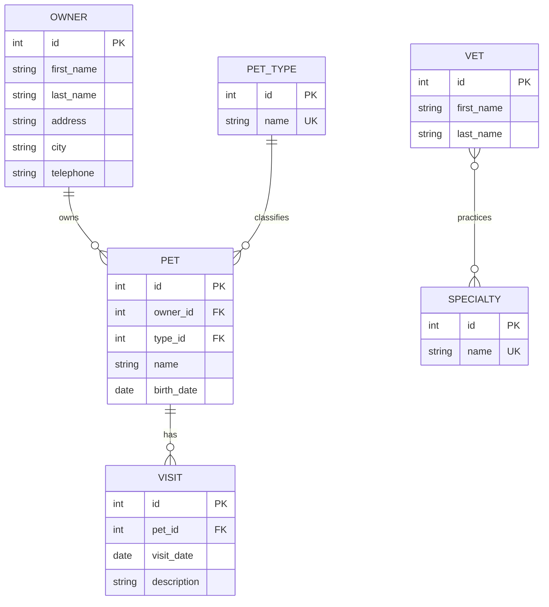

# Spring PetClinic REST Porting Specification

> Working document only. Keep this file untracked and do not include it in a commit or pull request.

## 1. Purpose

This document defines the feature and API surface required to port Spring
PetClinic REST to this FastAPI template. The finished application is an API-only
service operated through FastAPI's Swagger UI. A Thymeleaf, Angular, React, or
other end-user interface is outside the scope of this port.

The compatibility baseline is the current
[`spring-petclinic/spring-petclinic-rest`](https://github.com/spring-petclinic/spring-petclinic-rest)
project and its
[`openapi.yml`](https://github.com/spring-petclinic/spring-petclinic-rest/blob/master/src/main/resources/openapi.yml).
The canonical server-rendered Spring PetClinic is useful for business-rule
context, but its HTML routes are not part of this API port.

### Target interface

- Swagger UI: `/docs`
- OpenAPI document: `/openapi.json`
- ReDoc: `/redoc` (provided by FastAPI, but not required for acceptance)
- Application health: `/health`
- PetClinic API base path: `/api`
- Authentication: the template's Keycloak OAuth2 authorization-code flow with
  PKCE, usable directly from Swagger UI

## 2. Scope and verdict

The template can implement the complete PetClinic REST feature set without an
architectural rewrite. Its existing route, service, repository, Pydantic,
SQLAlchemy, Alembic, PostgreSQL, Keycloak, telemetry, and test layers are the
foundation for the port.

The current generic `Entity` resource is only an example vertical slice. It must
be replaced by the PetClinic domain described below.

### Included

- Owner management and last-name search
- Pets belonging to owners
- Pet types
- Visit history and visit booking
- Veterinarians and their specialties
- Full CRUD endpoints exposed by Spring PetClinic REST
- Paginated v2 owner and pet listing endpoints
- Swagger schemas, examples, response documentation, and OAuth login
- PostgreSQL schema migrations and canonical demonstration data
- Role-based authorization using Keycloak roles
- Consistent validation and problem responses
- Unit, repository, API integration, and end-to-end scenario tests

### Excluded

- Thymeleaf pages and Spring MVC form routes
- Angular or another separate frontend
- H2, HSQLDB, and MySQL runtime profiles; PostgreSQL is the target database
- Local password storage as the primary identity system; Keycloak remains the
  source of authentication and roles
- Java/Spring implementation parity where it has no externally observable API
  effect

## 3. Functional feature catalogue

### 3.1 Owners

An owner represents the person responsible for one or more pets.

Capabilities:

- Create an owner.
- List all owners.
- Filter owners by a last-name prefix.
- Retrieve one owner, including that owner's pets and their visits.
- Update an owner's editable fields.
- Delete an owner.
- Return a paginated owner result with page metadata.
- Add, retrieve, and update pets within the context of an owner.
- Add a visit within the context of an owner and pet.

Editable fields:

| Field       | Type   | Rules                                                                                                           |
| ----------- | ------ | --------------------------------------------------------------------------------------------------------------- |
| `firstName` | string | Required, 1-30 characters; Unicode letters with limited spaces, apostrophes, or hyphens                         |
| `lastName`  | string | Required, 1-30 characters; Unicode letters with limited spaces, apostrophes, hyphens, and optional final period |
| `address`   | string | Required, 1-255 characters                                                                                      |
| `city`      | string | Required, 1-80 characters                                                                                       |
| `telephone` | string | Required; digits only; preserve leading zeroes                                                                  |

For canonical PetClinic behavior, telephone numbers should be exactly 10
digits. The upstream OpenAPI document permits up to 20 digits while its Java
model requires exactly 10. This port should use the stricter 10-digit business
rule and document it in Swagger.

### 3.2 Pets

A pet belongs to exactly one owner, has exactly one pet type, and can have zero
or more visits.

Capabilities:

- Add a pet to an owner.
- List all pets.
- Return a paginated list of pets.
- Retrieve a pet globally by ID.
- Retrieve a pet only when it belongs to a specified owner.
- Update a pet globally or through its owner-scoped route.
- Delete a pet.
- Include pet type, owner ID, and visits in read responses.

Editable fields:

| Field       | Type              | Rules                                                               |
| ----------- | ----------------- | ------------------------------------------------------------------- |
| `name`      | string            | Required, nonblank, maximum 30 characters                           |
| `birthDate` | ISO date          | Required; cannot be in the future; cannot be more than 50 years ago |
| `type`      | PetType reference | Required; referenced pet type must exist                            |

Business invariants:

- A pet cannot be reassigned to another owner through the owner-scoped update
  route.
- A pet ID under `/owners/{ownerId}` must actually belong to that owner.
- Pet names should be unique for the same owner, compared
  case-insensitively. Enforce this in both the service layer and a database
  constraint/index.
- Deleting a pet must also remove its visits, or be rejected consistently if
  cascade deletion is intentionally disabled. The target behavior is cascade
  deletion.

### 3.3 Pet types

Pet types are managed reference data such as `cat`, `dog`, `lizard`, `snake`,
`bird`, and `hamster`.

Capabilities:

- List all pet types.
- Retrieve a pet type by ID.
- Create, rename, and delete a pet type.
- Prevent deletion while the type is referenced by a pet, returning a conflict
  response.

Fields:

| Field  | Type    | Rules                                                |
| ------ | ------- | ---------------------------------------------------- |
| `id`   | integer | Read-only positive identifier                        |
| `name` | string  | Required, 1-80 characters, unique case-insensitively |

### 3.4 Visits

A visit belongs to exactly one pet and records a dated clinical event or
appointment.

Capabilities:

- Add a visit directly by specifying `petId`.
- Add a visit through an owner and pet route.
- List all visits.
- Retrieve, update, and delete a visit by ID.
- Include visits in pet and owner detail responses.

Fields:

| Field         | Type     | Rules                                                                     |
| ------------- | -------- | ------------------------------------------------------------------------- |
| `id`          | integer  | Read-only positive identifier                                             |
| `petId`       | integer  | Required for direct creation; referenced pet must exist                   |
| `date`        | ISO date | Optional in the upstream schema; default to the current date when omitted |
| `description` | string   | Required, nonblank, 1-255 characters                                      |

The canonical web application books future appointments, while the REST fork
also contains historical sample visits. Therefore, the REST port must allow
past, present, and future visit dates. Pet birth-date rules must not be reused
for visits.

### 3.5 Veterinarians

A veterinarian is a person with zero or more specialties.

Capabilities:

- List all veterinarians.
- Retrieve one veterinarian.
- Create, update, and delete a veterinarian.
- Assign existing specialties during create or update.
- Return specialties embedded in veterinarian responses.

Fields:

| Field         | Type    | Rules                                                         |
| ------------- | ------- | ------------------------------------------------------------- |
| `id`          | integer | Read-only positive identifier                                 |
| `firstName`   | string  | Required, 1-30 characters; same name rules as owners          |
| `lastName`    | string  | Required, 1-30 characters; same name rules as owners          |
| `specialties` | array   | Required; may be empty; every referenced specialty must exist |

The vet-specialty relationship is many-to-many. Duplicate assignments must be
prevented by a composite unique constraint.

### 3.6 Specialties

Specialties are managed reference data such as `radiology`, `surgery`, and
`dentistry`.

Capabilities:

- List all specialties.
- Retrieve a specialty by ID.
- Create, rename, and delete a specialty.
- Prevent deletion while assigned to a veterinarian, unless assignments are
  explicitly removed in the same transaction.

Fields:

| Field  | Type    | Rules                                                |
| ------ | ------- | ---------------------------------------------------- |
| `id`   | integer | Read-only positive identifier                        |
| `name` | string  | Required, 1-80 characters, unique case-insensitively |

### 3.7 Users and roles

The Spring REST application optionally stores local users and protects routes
with HTTP Basic authentication. This template already uses Keycloak and must
not duplicate password storage.

The compatibility endpoint `POST /api/users` remains documented. Its FastAPI
implementation should provision a Keycloak user through an administrative
service only if this endpoint is required. It must never store or return a
plaintext password.

Roles:

| Role          | Access                                                          |
| ------------- | --------------------------------------------------------------- |
| `OWNER_ADMIN` | Owners, pets, visits, and read access to pet types              |
| `VET_ADMIN`   | Veterinarians, specialties, and pet-type management             |
| `ADMIN`       | User provisioning; may be configured as a superset of all roles |

For a simple demonstration environment, a single Keycloak user can hold all
three roles. Swagger's OAuth login should obtain and send the access token.

## 4. Domain model



Database requirements:

- Use integer identity keys for PetClinic compatibility. The template's sample
  model uses UUIDs, but PetClinic clients and schemas use integers.
- Index owner last name for prefix searches.
- Index pet owner ID, pet type ID, pet name, and visit pet ID.
- Add `UNIQUE (vet_id, specialty_id)` to `vet_specialties`.
- Add a case-insensitive uniqueness rule for `(owner_id, pet_name)`.
- Use foreign keys for every relationship.
- Cascade owner deletion to pets and visits, and pet deletion to visits.
- Do not cascade pet-type or specialty deletion into domain records.
- Load relationships deliberately; avoid async lazy-loading and N+1 queries.

## 5. API conventions

### 5.1 Media types and serialization

- Requests and responses use `application/json`.
- Dates use ISO `YYYY-MM-DD` strings.
- Date-times in errors use RFC 3339 UTC values.
- IDs are positive integers.
- Read-only fields such as IDs, `ownerId`, and nested collections are omitted
  from create/update request models.
- Swagger must use separate create, update, and response schemas rather than
  accepting response-only fields in write payloads.

### 5.2 Success status policy

The upstream OpenAPI document and controller implementations disagree on some
status codes. The FastAPI port should use a consistent REST policy:

- `GET`: `200 OK`
- `POST` creating a resource: `201 Created` with a `Location` header and the
  created response body
- `PUT`: `200 OK` with the updated response body
- `DELETE`: `204 No Content`
- Empty collection: `200 OK` with `[]`, never `404`

The upstream controllers commonly return `204` from updates and `404` for an
empty collection. Those quirks should not be copied unless byte-for-byte client
compatibility becomes a requirement.

### 5.3 Error status policy

- `400 Bad Request`: malformed JSON or business/input validation failure
- `401 Unauthorized`: missing or invalid access token
- `403 Forbidden`: authenticated caller lacks the required role
- `404 Not Found`: requested owner, pet, visit, veterinarian, pet type, or
  specialty does not exist; owner-scoped pet does not belong to that owner
- `409 Conflict`: uniqueness or referential-integrity conflict
- `500 Internal Server Error`: unexpected server failure with no sensitive
  implementation detail exposed

FastAPI normally reports request validation as `422`. For PetClinic contract
compatibility, register a request-validation handler that emits `400` using the
problem schema below.

### 5.4 Problem response

Every error should use one shape:

```json
{
  "type": "https://example.test/problems/validation-error",
  "title": "Validation error",
  "status": 400,
  "detail": "The request contains invalid or missing fields.",
  "timestamp": "2026-07-18T12:00:00Z",
  "schemaValidationErrors": [
    {
      "message": "telephone must contain exactly 10 digits",
      "field": "telephone"
    }
  ]
}
```

Do not expose SQL messages, stack traces, Keycloak secrets, tokens, or internal
hostnames.

### 5.5 Pagination

The v2 list endpoints use zero-based pagination:

- `page`: integer, minimum `0`, default `0`
- `size`: integer, minimum `1`, default `20`, target maximum `100`
- Stable ordering by `id` ascending

Response:

```json
{
  "content": [],
  "page": 0,
  "size": 20,
  "totalElements": 0,
  "totalPages": 0
}
```

### 5.6 ETags and conditional requests

The upstream OpenAPI file documents `ETag` and `304 Not Modified` on several
GET operations, but its controller implementation does not consistently
implement conditional requests. Treat ETags as an optional compatibility
enhancement after the core API is complete. Do not advertise `304` in generated
OpenAPI until it is actually implemented and tested.

## 6. Complete endpoint catalogue

The Spring PetClinic REST OpenAPI surface contains 37 operations.

### 6.1 Support endpoint

| Method | Path        | Operation        | Success | Behavior                                                                                                                                          |
| ------ | ----------- | ---------------- | ------- | ------------------------------------------------------------------------------------------------------------------------------------------------- |
| `GET`  | `/api/oops` | `failingRequest` | None    | Deliberately raises an application error to demonstrate the problem response. Keep only outside production or gate behind an environment setting. |

The template already provides `GET /health`; it replaces the upstream Actuator
health URL for this port.

### 6.2 Owner endpoints

| Method   | Path                                        | Operation         | Request                                     | Success         | Behavior                                                                                                |
| -------- | ------------------------------------------- | ----------------- | ------------------------------------------- | --------------- | ------------------------------------------------------------------------------------------------------- |
| `GET`    | `/api/owners`                               | `listOwners`      | Optional `lastName` query                   | `200 Owner[]`   | Lists owners. When `lastName` is present, return owners whose last name starts with the supplied value. |
| `POST`   | `/api/owners`                               | `addOwner`        | `OwnerCreate`                               | `201 Owner`     | Creates an owner and returns `Location: /api/owners/{id}`.                                              |
| `GET`    | `/api/v2/owners`                            | `listOwnersPage`  | Optional `lastName`, `page`, `size` queries | `200 OwnerPage` | Paginated owner search, default page `0`, size `20`, ordered by ID.                                     |
| `GET`    | `/api/owners/{ownerId}`                     | `getOwner`        | Integer path ID                             | `200 Owner`     | Returns owner details with pets and their visits.                                                       |
| `PUT`    | `/api/owners/{ownerId}`                     | `updateOwner`     | `OwnerUpdate`                               | `200 Owner`     | Replaces editable owner fields; ignores/rejects body IDs and nested pets.                               |
| `DELETE` | `/api/owners/{ownerId}`                     | `deleteOwner`     | Integer path ID                             | `204`           | Deletes the owner and cascades deletion to pets and visits.                                             |
| `POST`   | `/api/owners/{ownerId}/pets`                | `addPetToOwner`   | `PetCreate`                                 | `201 Pet`       | Creates a pet for the owner and returns `Location: /api/pets/{id}`.                                     |
| `GET`    | `/api/owners/{ownerId}/pets/{petId}`        | `getOwnersPet`    | Owner and pet path IDs                      | `200 Pet`       | Returns the pet only when it belongs to the owner.                                                      |
| `PUT`    | `/api/owners/{ownerId}/pets/{petId}`        | `updateOwnersPet` | `PetUpdate`                                 | `200 Pet`       | Updates the pet without changing ownership.                                                             |
| `POST`   | `/api/owners/{ownerId}/pets/{petId}/visits` | `addVisitToOwner` | `VisitCreateNested`                         | `201 Visit`     | Creates a visit only when the pet belongs to the owner; returns `Location: /api/visits/{id}`.           |

### 6.3 Pet endpoints

| Method   | Path                | Operation      | Request                         | Success       | Behavior                                                         |
| -------- | ------------------- | -------------- | ------------------------------- | ------------- | ---------------------------------------------------------------- |
| `GET`    | `/api/pets`         | `listPets`     | None                            | `200 Pet[]`   | Lists all pets with type, owner ID, and visits.                  |
| `GET`    | `/api/v2/pets`      | `listPetsPage` | Optional `page`, `size` queries | `200 PetPage` | Paginated pet list, default page `0`, size `20`, ordered by ID.  |
| `GET`    | `/api/pets/{petId}` | `getPet`       | Integer path ID                 | `200 Pet`     | Returns one pet.                                                 |
| `PUT`    | `/api/pets/{petId}` | `updatePet`    | `PetUpdate`                     | `200 Pet`     | Updates name, birth date, and type. Ownership remains unchanged. |
| `DELETE` | `/api/pets/{petId}` | `deletePet`    | Integer path ID                 | `204`         | Deletes the pet and its visits.                                  |

Pet creation is intentionally owner-scoped; there is no global
`POST /api/pets` in the upstream contract.

### 6.4 Pet-type endpoints

| Method   | Path                        | Operation       | Request         | Success         | Behavior                                                   |
| -------- | --------------------------- | --------------- | --------------- | --------------- | ---------------------------------------------------------- |
| `GET`    | `/api/pettypes`             | `listPetTypes`  | None            | `200 PetType[]` | Lists pet types, preferably sorted by name.                |
| `POST`   | `/api/pettypes`             | `addPetType`    | `PetTypeCreate` | `201 PetType`   | Creates a unique pet type and returns its `Location`.      |
| `GET`    | `/api/pettypes/{petTypeId}` | `getPetType`    | Integer path ID | `200 PetType`   | Returns one pet type.                                      |
| `PUT`    | `/api/pettypes/{petTypeId}` | `updatePetType` | `PetTypeUpdate` | `200 PetType`   | Renames a pet type.                                        |
| `DELETE` | `/api/pettypes/{petTypeId}` | `deletePetType` | Integer path ID | `204`           | Deletes an unreferenced pet type; otherwise returns `409`. |

### 6.5 Visit endpoints

| Method   | Path                    | Operation     | Request                         | Success       | Behavior                                             |
| -------- | ----------------------- | ------------- | ------------------------------- | ------------- | ---------------------------------------------------- |
| `GET`    | `/api/visits`           | `listVisits`  | None                            | `200 Visit[]` | Lists visits with their pet IDs.                     |
| `POST`   | `/api/visits`           | `addVisit`    | `VisitCreate` including `petId` | `201 Visit`   | Creates a visit and returns its `Location`.          |
| `GET`    | `/api/visits/{visitId}` | `getVisit`    | Integer path ID                 | `200 Visit`   | Returns one visit.                                   |
| `PUT`    | `/api/visits/{visitId}` | `updateVisit` | `VisitUpdate`                   | `200 Visit`   | Updates date and description; cannot change the pet. |
| `DELETE` | `/api/visits/{visitId}` | `deleteVisit` | Integer path ID                 | `204`         | Deletes the visit.                                   |

### 6.6 Specialty endpoints

| Method   | Path                             | Operation         | Request           | Success           | Behavior                                                  |
| -------- | -------------------------------- | ----------------- | ----------------- | ----------------- | --------------------------------------------------------- |
| `GET`    | `/api/specialties`               | `listSpecialties` | None              | `200 Specialty[]` | Lists specialties, preferably sorted by name.             |
| `POST`   | `/api/specialties`               | `addSpecialty`    | `SpecialtyCreate` | `201 Specialty`   | Creates a unique specialty and returns its `Location`.    |
| `GET`    | `/api/specialties/{specialtyId}` | `getSpecialty`    | Integer path ID   | `200 Specialty`   | Returns one specialty.                                    |
| `PUT`    | `/api/specialties/{specialtyId}` | `updateSpecialty` | `SpecialtyUpdate` | `200 Specialty`   | Renames a specialty.                                      |
| `DELETE` | `/api/specialties/{specialtyId}` | `deleteSpecialty` | Integer path ID   | `204`             | Deletes an unassigned specialty; otherwise returns `409`. |

### 6.7 Veterinarian endpoints

| Method   | Path                | Operation   | Request         | Success     | Behavior                                                                        |
| -------- | ------------------- | ----------- | --------------- | ----------- | ------------------------------------------------------------------------------- |
| `GET`    | `/api/vets`         | `listVets`  | None            | `200 Vet[]` | Lists veterinarians and embedded specialties.                                   |
| `POST`   | `/api/vets`         | `addVet`    | `VetCreate`     | `201 Vet`   | Creates a veterinarian using existing specialty IDs and returns its `Location`. |
| `GET`    | `/api/vets/{vetId}` | `getVet`    | Integer path ID | `200 Vet`   | Returns one veterinarian and specialties.                                       |
| `PUT`    | `/api/vets/{vetId}` | `updateVet` | `VetUpdate`     | `200 Vet`   | Updates names and replaces specialty assignments transactionally.               |
| `DELETE` | `/api/vets/{vetId}` | `deleteVet` | Integer path ID | `204`       | Removes specialty associations and deletes the veterinarian.                    |

### 6.8 User endpoint

| Method | Path         | Operation | Request      | Success    | Behavior                                                                                                                 |
| ------ | ------------ | --------- | ------------ | ---------- | ------------------------------------------------------------------------------------------------------------------------ |
| `POST` | `/api/users` | `addUser` | `UserCreate` | `201 User` | Admin-only Keycloak user provisioning compatibility endpoint. Password must be write-only and omitted from the response. |

## 7. Swagger schema catalogue

### Owner schemas

- `OwnerCreate`: `firstName`, `lastName`, `address`, `city`, `telephone`
- `OwnerUpdate`: same editable fields as create
- `Owner`: editable fields plus read-only `id` and read-only `pets[]`
- `OwnerPage`: `content`, `page`, `size`, `totalElements`, `totalPages`

### Pet schemas

- `PetCreate`: `name`, `birthDate`, and a pet-type reference
- `PetUpdate`: same editable fields as create
- `Pet`: editable fields plus read-only `id`, `ownerId`, and `visits[]`
- `PetPage`: `content`, `page`, `size`, `totalElements`, `totalPages`

For write operations, prefer `typeId` over accepting a complete writable
`PetType` object. The response can embed the complete `PetType`.

### Visit schemas

- `VisitCreate`: `petId`, optional `date`, `description`
- `VisitCreateNested`: optional `date`, `description`; pet comes from the path
- `VisitUpdate`: optional `date`, required `description`
- `Visit`: read-only `id`, `petId`, plus `date`, `description`

### Veterinarian schemas

- `VetCreate`: `firstName`, `lastName`, `specialtyIds[]`
- `VetUpdate`: same editable fields as create
- `Vet`: read-only `id`, names, and embedded `specialties[]`

### Reference-data schemas

- `PetTypeCreate` and `PetTypeUpdate`: `name`
- `PetType`: read-only `id`, `name`
- `SpecialtyCreate` and `SpecialtyUpdate`: `name`
- `Specialty`: read-only `id`, `name`

### User schemas

- `UserCreate`: `username`, `password`, `enabled`, `roles[]`
- `User`: `username`, `enabled`, `roles[]`; never return `password`
- `Role`: `name`

## 8. Security mapping

All `/api` routes except an explicitly enabled demonstration `/api/oops` route
should require a bearer token in the deployed application. `/health`, `/docs`,
and `/openapi.json` may remain reachable, while Swagger operations use the
configured OAuth login.

| Endpoint group | Read roles                          | Write roles            |
| -------------- | ----------------------------------- | ---------------------- |
| Owners         | `OWNER_ADMIN`, `ADMIN`              | `OWNER_ADMIN`, `ADMIN` |
| Pets           | `OWNER_ADMIN`, `ADMIN`              | `OWNER_ADMIN`, `ADMIN` |
| Visits         | `OWNER_ADMIN`, `ADMIN`              | `OWNER_ADMIN`, `ADMIN` |
| Pet types      | `OWNER_ADMIN`, `VET_ADMIN`, `ADMIN` | `VET_ADMIN`, `ADMIN`   |
| Veterinarians  | `VET_ADMIN`, `ADMIN`                | `VET_ADMIN`, `ADMIN`   |
| Specialties    | `VET_ADMIN`, `ADMIN`                | `VET_ADMIN`, `ADMIN`   |
| Users          | `ADMIN`                             | `ADMIN`                |

Authorization must be enforced in dependencies or services, not only described
in Swagger.

## 9. Demonstration data

Provide an idempotent Alembic data migration or explicit seed command with the
recognizable PetClinic dataset:

- 6 veterinarians
- 3 specialties: radiology, surgery, dentistry
- 6 pet types: cat, dog, lizard, snake, bird, hamster
- 10 owners
- 13 pets
- 4 historical visits

Do not seed a local password hash. Provision the demonstration Keycloak user and
roles through the existing realm configuration.

Seed data must be safe to apply exactly once and must not overwrite user-created
records.

## 10. FastAPI template mapping

| PetClinic concern                                    | Template location   |
| ---------------------------------------------------- | ------------------- |
| SQLAlchemy entities and relationships                | `app/model/`        |
| Request and response schemas                         | `app/io/`           |
| Business validation and transactions                 | `app/service/`      |
| Queries and persistence                              | `app/repository/`   |
| HTTP operations and Swagger metadata                 | `app/routes/`       |
| Error classes and problem serialization              | `app/exceptions/`   |
| Database evolution and seed data                     | `alembic/versions/` |
| OIDC token validation and authorization dependencies | `app/auth/`         |
| Unit and integration tests                           | `tests/`            |
| End-to-end API behavior                              | `scenario-tests/`   |

Suggested modules:

```text
app/
  io/
    owner.py
    pet.py
    reference.py
    user.py
    vet.py
    visit.py
  model/
    owner.py
    pet.py
    pet_type.py
    specialty.py
    vet.py
    visit.py
  repository/
    owner.py
    pet.py
    pet_type.py
    specialty.py
    vet.py
    visit.py
  routes/
    owner.py
    pet.py
    pet_type.py
    specialty.py
    user.py
    vet.py
    visit.py
  service/
    owner.py
    pet.py
    reference.py
    user.py
    vet.py
    visit.py
```

Preserve the template's import-linter boundaries: routes call services,
services call repositories, and routes do not access persistence directly.

## 11. Implementation sequence

1. Replace the generic entity domain with integer-ID PetClinic models and
   migrations.
2. Add pet types, specialties, canonical seed data, and relationship
   constraints.
3. Implement Pydantic write/read schemas and the common problem response.
4. Implement owner, nested pet, and nested visit operations.
5. Implement global pet and visit operations.
6. Implement veterinarian, specialty, and pet-type CRUD.
7. Add v2 owner/pet pagination and count queries.
8. Add Keycloak role checks and Swagger security documentation.
9. Decide whether `/api/users` is enabled as Keycloak provisioning or returns
   `501 Not Implemented` until a safe admin integration exists.
10. Add scenario tests, seed verification, telemetry checks, and final OpenAPI
    review.

## 12. Test and acceptance checklist

### Domain and database

- [ ] All six domain resources and the vet-specialty association are migrated.
- [ ] Foreign keys, unique constraints, indexes, and cascades are tested.
- [ ] Owner deletion removes pets and visits atomically.
- [ ] Pet deletion removes visits atomically.
- [ ] A referenced pet type or specialty cannot be deleted silently.
- [ ] Duplicate pet names for one owner are rejected case-insensitively.
- [ ] The same pet name is allowed for different owners.

### Validation

- [ ] Owner names, address, city, and telephone rules are covered.
- [ ] Pet name, type, birth-date future limit, and 50-year age limit are covered.
- [ ] Visit description and date behavior are covered.
- [ ] Missing related resources return `404`.
- [ ] Constraint conflicts return `409`.
- [ ] Request validation returns documented `400` problem bodies.

### Endpoint behavior

- [ ] All 37 operations appear in Swagger under meaningful tags.
- [ ] Every create returns `201` and a valid `Location` header.
- [ ] Every update returns the updated resource with `200`.
- [ ] Every delete returns `204` with no response body.
- [ ] Empty list endpoints return `200` and an empty array/page.
- [ ] Owner last-name prefix search works.
- [ ] Owner-scoped pet routes reject pets belonging to another owner.
- [ ] Pagination totals and stable ordering are correct.
- [ ] Response serialization does not trigger async lazy-loading errors or N+1
      query explosions.

### Security

- [ ] Swagger OAuth login works with PKCE.
- [ ] Missing/invalid tokens return `401`.
- [ ] Incorrect roles return `403`.
- [ ] `OWNER_ADMIN`, `VET_ADMIN`, and `ADMIN` route matrices are tested.
- [ ] Passwords and tokens never appear in responses or logs.

### Quality and operations

- [ ] Unit, integration, and scenario tests pass.
- [ ] Ruff, Ty, Import Linter, and coverage checks pass.
- [ ] Alembic upgrades work on a fresh PostgreSQL database.
- [ ] Docker Compose starts migrations, Keycloak, PostgreSQL, and the API.
- [ ] `/health`, `/docs`, and `/openapi.json` work in the composed stack.
- [ ] Logfire/OpenTelemetry records API and SQL spans without sensitive data.

## 13. Definition of done

The port is complete when a user can authenticate from Swagger UI and execute
the complete PetClinic workflow:

1. Create or select reference pet types and specialties.
2. Create an owner.
3. Add a pet to that owner.
4. Book and manage visits for the pet.
5. Create a veterinarian and assign specialties.
6. Search and page through owners and pets.
7. Retrieve all related data from owner, pet, vet, and visit endpoints.
8. Update and delete resources with correct validation, authorization,
   transaction, and conflict behavior.

All behavior must be visible and accurately described in Swagger; no separate
frontend is required.
