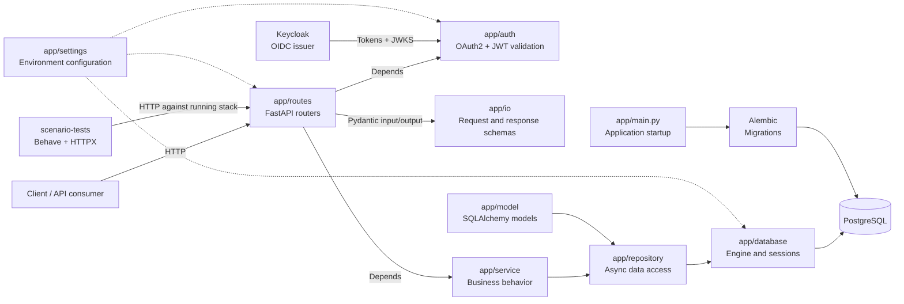

# FastAPI Template

[](https://sonarcloud.io/summary/new_code?id=Subhransu-De_FastAPI-Template)
[](https://sonarcloud.io/summary/new_code?id=Subhransu-De_FastAPI-Template)
[](https://sonarcloud.io/summary/new_code?id=Subhransu-De_FastAPI-Template)
[](https://sonarcloud.io/summary/new_code?id=Subhransu-De_FastAPI-Template)
[](https://snyk.io/test/github/Subhransu-De/FastAPI-Template)
[](https://github.com/Subhransu-De/FastAPI-Template/actions/workflows/workflow.yml)


A production-minded FastAPI starter that gives you a clean async API, a real database path, authentication, observability, CI checks, and multiple test layers from day one.

## What It Contains

| Area                    | Included                                                                                           |
| ----------------------- | -------------------------------------------------------------------------------------------------- |
| API                     | FastAPI application with health endpoints and protected CRUD routes for entities.                  |
| Database                | PostgreSQL, SQLAlchemy async sessions, Psycopg, and Alembic migrations applied on startup.         |
| Authentication          | OAuth2 authorization-code flow, JWT bearer validation, and a Keycloak-backed Docker setup.         |
| Validation and settings | Pydantic v2 schemas and `pydantic-settings` based application, database, and auth configuration.   |
| Observability           | Structured logging plus Logfire/OpenTelemetry instrumentation for FastAPI and SQLAlchemy.          |
| Local runtime           | Docker Compose stack for the API, PostgreSQL, and Keycloak.                                        |
| Quality gates           | Ruff linting, Ty type checks, coverage enforcement, SonarCloud analysis, and Snyk security status. |
| Dependency upkeep       | Dependabot is configured for Python, Docker, Docker Compose, and GitHub Actions updates.           |

## Testing Strategy

This template keeps tests split by purpose so each feedback loop stays clear:

- **Unit tests** cover isolated settings, auth, service, IO, logging, and exception behavior.
- **Integration tests** exercise the API and repository with disposable PostgreSQL through Testcontainers.
- **Scenario tests** live in `scenario-tests` and use Behave plus HTTPX against the running Docker Compose stack.
- **Coverage checks** run with `pytest-cov`; CI currently enforces at least 80% coverage.
- **Mutation testing** is configured for auth, IO, service, and repository modules, but kept outside the normal PR gate.

## Architecture

At a glance, the template wires requests, authentication, business behavior,
persistence, migrations, and scenario tests like this:



The application uses a small layered architecture:

- `app/routes` owns HTTP endpoints, request dependencies, and route grouping.
- `app/service` holds business behavior and coordinates repository calls.
- `app/repository` isolates persistence logic behind reusable async repository helpers.
- `app/model` defines SQLAlchemy database models.
- `app/io` defines request and response schemas at the API boundary.
- `app/settings`, `app/auth`, and `app/logger` keep cross-cutting concerns separate from endpoint logic.

This shape is meant for teams that want a practical backend template: simple enough to understand quickly, but structured enough to grow into a real service without immediately rewriting the foundation.

## Installation

```bash
uv sync
cp .env.example .env
```

Fill in the required values in `.env` before starting the app.

## Running the Application

Development mode:

```bash
uv run --env-file .env python -m app.main --reload
```

Docker-based development:

```bash
docker compose up --build
```

## Testing

Run the default test suite:

```bash
make test
```

Run tests with coverage:

```bash
make test-cov
```

Run scenario tests against the Docker Compose stack:

```bash
docker compose up --build --wait
cd scenario-tests
uv sync
uv run behave
```

Run mutation testing from Linux or WSL because `mutmut` requires fork support:

```bash
uv run --group test --with mutmut mutmut run
```

## Maintenance

The GitHub Actions workflow runs Ruff, Ty, unit tests, integration tests, coverage, Docker image build validation, and scenario tests. Dependabot keeps dependency updates visible, while SonarCloud and Snyk expose code-quality and security status at the top of this README.
