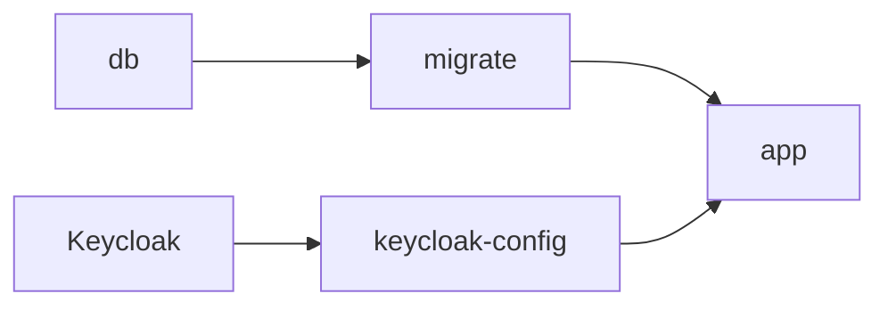

# Local Development

The project supports a host-run application and a complete Docker Compose stack. Keycloak details are documented separately in [Local Keycloak](local-keycloak.md).

## Host-run application

`make run` applies Alembic migrations and then starts FastAPI using `.env`:

```text
Alembic migration → FastAPI process
```

PostgreSQL and the configured OIDC provider must already be reachable. Reloading is controlled by `RELOAD`; it is disabled in `.env.example`.

## Compose stack

The local stack has five services:



- `db` is PostgreSQL and stores data in a named volume.
- `migrate` applies Alembic migrations and exits.
- `keycloak-config` adjusts the local browser callback and exits.
- `app` starts only after the database, migration, and identity services are ready.

`POSTGRES_PASSWORD` and `KEYCLOAK_ADMIN_PASSWORD` are required Compose values. The application database and OIDC addresses are supplied by Compose, so their container-facing hostnames differ from host-run values.

The application source is copied into its image rather than mounted. Code changes therefore require an image rebuild. This makes the local container match the image tested by CI.

## Images and state

The application and migrations use separate images. The application image contains runtime code; the migration image contains Alembic and its migration-only dependencies. This keeps schema changes explicit instead of running them during application startup.

PostgreSQL data survives a normal `docker compose down`. Removing volumes resets it:

```bash
docker compose down -v
```

## Isolated stacks

`COMPOSE_PROJECT_NAME` separates container names, networks, volumes, and default image tags. Parallel stacks must also use distinct host ports and public URLs:

```text
APP_PORT, APP_PUBLIC_URL, KEYCLOAK_PORT, OIDC_PUBLIC_URL
```

`APP_PUBLIC_URL` and `OIDC_PUBLIC_URL` are externally visible addresses. Compose service names such as `db` and `keycloak` are internal addresses and do not change with host ports.

The Compose stack is development infrastructure. Production deployments use separately managed databases, identity services, networking, secrets, and migration jobs.
